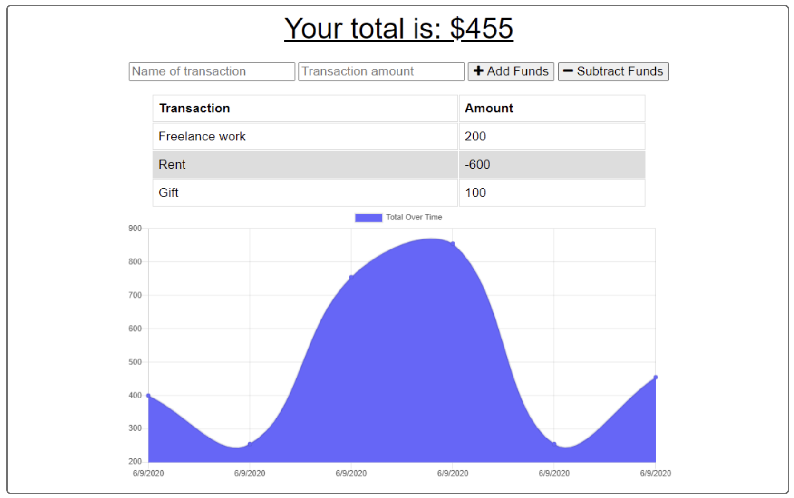

# BUDGET TRACKER

## Description
A budget tracker application that allows for offline acces and functionality. Users are able to add expenses and deposits to their budget with or without a connection. When users enter transactions offline, that total is updated once a connection is re-established.

### User Story
AS AN avid traveler
I WANT to be able to track my withdrawals and deposits with or without a data/internet connection
SO THAT my account balance is accurate when I am traveling

## Table of Contents
- <a href="#acceptance-criteria">Acceptance Criteria</a>
- <a href="#installation">Installation</a>
- <a href="#usage">Usage</a>
- <a href="#mock-up">Mock-Up</a>
- <a href="#deployed-application">Deployed Application</a>
- <a href="contributors">Contributors</a>
- <a href="#license">License</a>

## Acceptance Criteria
GIVEN a budget tracker without an internet connection

WHEN the user inputs an expense or deposit 
THEN they will receive a notification that they have added an expense or deposit

WHEN the user reestablishes an internet connection 
THEN the deposits or expenses added while they were offline are added to their transaction history and their totals are updated

## Installation
- Clone the directly from the GitHub repository to your local machine.
- Run _npm init_ in the command line.
- Run the command _node server.js_ to launch the application.

### Tools and Required Packages
- **IndexedDB** for browser-based offline storage
- **Service Worker** for offline functionality of the chached application
- **Express.js**
- **MongoDB** as its database
- **MongoDB Atlast** for **Heroku** deployment
- **Web Manifest** as the blueprint for the Progressive Web Application

## Usage
To access a community of tech professionals who share blog posts of new information or technologies and commentary on the blogs.

## Mock-Up

## Deployed Application
Deployed url: TBD 
Repo url: https://github.com/cpm-128/budget-tracker

### Screencapture

## Contributors
<a href="https://github.com/coding-boot-camp/symmetrical-bassoon" target="_blank">Starter code provided by UNC Chapel Hill Bootcamp.</a>

### Author
Colleen Maher is a front-end web developer with a background in marketing, operations, and project management.

Trained at UNC Chapel Hill to earn a Professional Certificate in full-stack web development. Newly developed skills include JavaScript, managing databases, responsive web design, and following the Model-View-Controller paradigm. I am an organized and detail-oriented coder wanting to create and contribute to improved user-experiences and database management in an increasingly digital world. Strengths in creativity, teamwork, and building projects from ideation to execution.

<a href="https://gist.github.com/cpm-128" target="_blank">GitHub Profile</a>
## License
MIT License

Copyright (c) [2022] [Colleen Maher]

Permission is hereby granted, free of charge, to any person obtaining a copy
of this software and associated documentation files (the "Software"), to deal
in the Software without restriction, including without limitation the rights
to use, copy, modify, merge, publish, distribute, sublicense, and/or sell
copies of the Software, and to permit persons to whom the Software is
furnished to do so, subject to the following conditions:

The above copyright notice and this permission notice shall be included in all
copies or substantial portions of the Software.